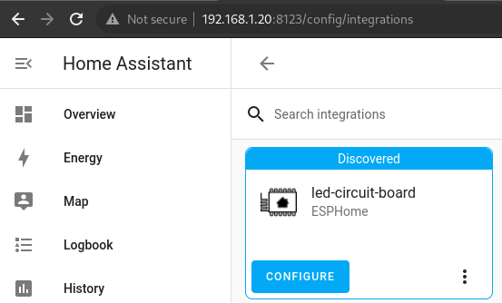

# ESPhome

[ESPhome](https://esphome.io/) will let you control all aspects of the circuit board and customize its features or behaviour. 

There are some limitations to the ESP8266 support. You cant's use FastLED as the most recent version don't play nice with the Arduino SDK but [NeoPixelBus Light](https://esphome.io/components/light/neopixelbus.html) will work just fine.

This is a basic configuration which should get you started if you are planning to use Home Assistant.

Create a new device in your ESPhome dashboard, copy the sample code from below and adjust the code. When your are done, press "INSTALL", choose "Plug into the computer running ESPHome Dashboard", select your serial adapter. Make sure that power on your ESP8266 with `I0` to `GND`.

```yaml
esphome:
  name: led-circuit-board

esp8266:
  board: esp01_1m

logger:

api:

ota:
  password: "14e347b1d6488a8852cb445b00a6a4ec"

wifi:
  ssid: !secret wifi_ssid
  password: !secret wifi_password

  # Enable fallback hotspot (captive portal) in case wifi connection fails
  ap:
    ssid: "Led-Circuit-Board"
    password: "qVezjKMWqcCM"

captive_portal:

binary_sensor:
  - platform: gpio
    pin:
      number: GPIO0
      inverted: true
    name: "Button 1"
  - platform: gpio
    pin:
      number: GPIO5
      inverted: true
    name: "Button 2"
  - platform: status
    name: "LED circuit board"

sensor:
  - platform: uptime
    name: "LED circuit board"

light:
  - platform: neopixelbus
    variant: WS2811
    pin: GPIO2
    num_leds: 7
    name: "LED circuit board"

```

After rebooting the device you will get a notification from Home Assistant that a new device was found.



Follow the wizard to get your device ready.

If you are using the sample from above it would like this:


