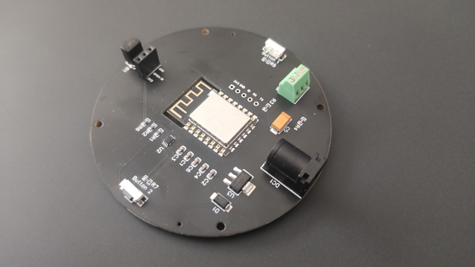

## LED circuit board

The circuit board features a ESP8266 microcontroller and supports the direct attachment of a LED strip. The form factor of the board and the four mounting holes allows easy placment in the buttom of a lamp, building the lamp around the board or for hanging application. There are two buttons, support for IR communication and a parrel plug (5 mm) for a 5V PSU. Additionally is the board prepared for a PIR sensor. For programming the ESP8266 you need a standard serial adapter (e.g., [Mini USB UART FTDI Programmer 3.3/5V USB Serial](https://www.bastelgarage.ch/mini-usb-uart-ftdi-programmer-3-3-5v-usb-serial)).

## Where can I get one?

The circuit board is sold at [https://www.bastelgarage.ch/bausatze/esp8266-wled-platine-d75](https://www.bastelgarage.ch/bausatze/esp8266-wled-platine-d75)

Accessories:

- [LED strip WS2812B - 60 LED/m NeoPixels](https://www.bastelgarage.ch/ws2812b-60led-m-led-neopixel-strip-0-165m) (required)
- [Power adapter 5 V/2 A](https://www.bastelgarage.ch/5v-dc-2000ma-stecknetzteil-ac-dc-adapter-5-5mm-2-1mm-stecker) (required)
- [Mini USB UART FTDI Programmer 3.3/5V USB Serial](https://www.bastelgarage.ch/mini-usb-uart-ftdi-programmer-3-3-5v-usb-serial) (no required but recommended)
- [Neopixels Stick - 8x WS2812](https://www.bastelgarage.ch/neopixel-stick-8x-ws2812-rgb-led) (not required but useful for testing)

## Details

- Button 1: GPIO0
- Button 2: GPIO5
- IR: GPIO4
- PIR: (GPIO4, requires that the IR is physically removed)
- LED: GPIO2

## Remarks

- The ESP8266 is using 3.3 V not 5 V. Keep that in mind when you want to program it.
- The ESP8266 doesn't support 5 GHz WiFi networks.
- The circuit board doesn't have fuses.

## Support

Please create a new [issue](https://github.com/bastelgarage/led-circuit-board/issues) or visit the [forum](https://forum.bastelgarage.ch/).
