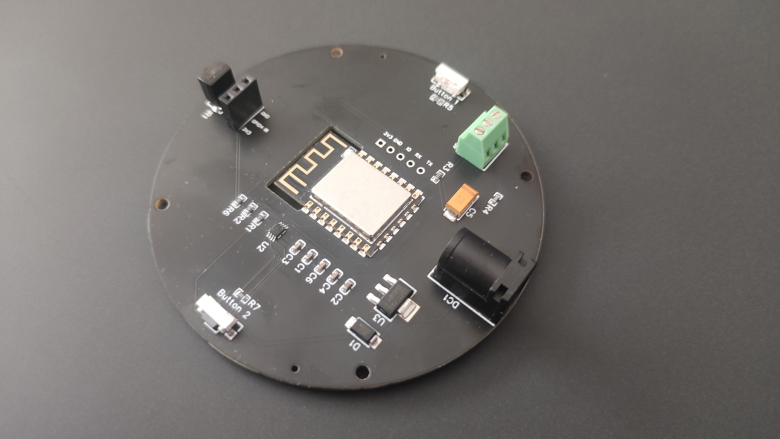

## LED circuit board

The circuit board features a ESP8266 microcontroller and supports the direct attachment of a LED strip. The form factor of the board and the four mounting holes allows easy placment in the buttom of a lamp, building the lamp around the board or for hanging application. There are two buttons, support for IR communication and a parrel plug (5 mm) for a 5V PSU. Additionally is the board preparred for a PIR sensor. For programming the ESP8266 you need a standard serial adapter (e.g., [Mini USB UART FTDI Programmer 3.3/5V USB Serial](https://www.bastelgarage.ch/mini-usb-uart-ftdi-programmer-3-3-5v-usb-serial)).

### Details

- Button 1: GPIO0
- IR: GPIO4
- PIR: (GPIO4, requires that the IR is physically removed)
- LED: GPIO2

