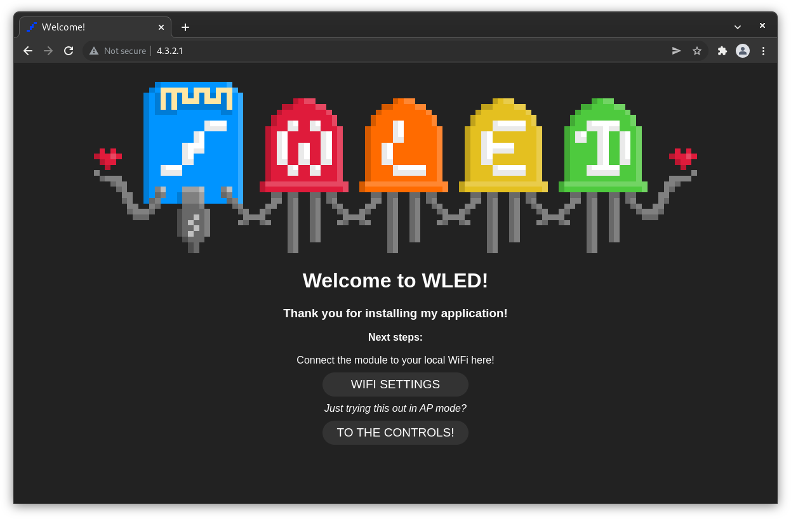
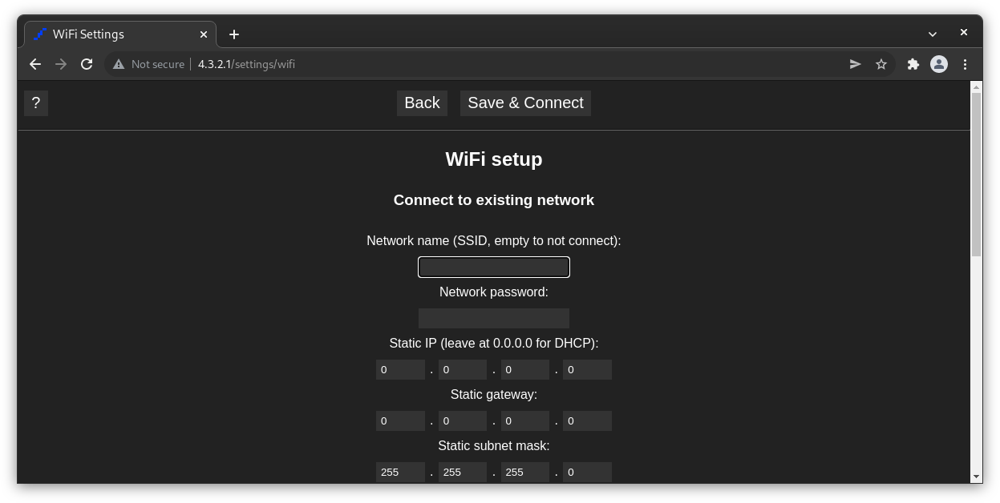
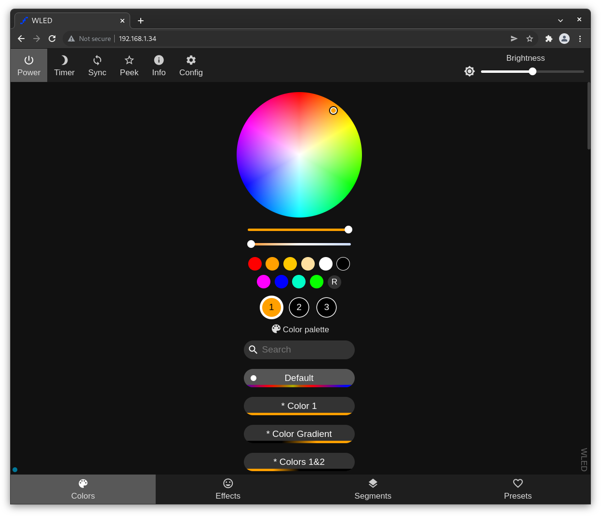
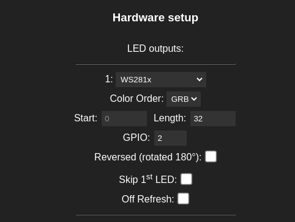

# WLED

[WLED](https://kno.wled.ge/) is a fast and feature-rich implementation of an ESP8266/ESP32 webserver to control NeoPixel (WS2812B, WS2811, SK6812) LEDs or also SPI based chipsets like the WS2801 and APA102. 

This firmware is pre-loaded.

If you have to re-flash your board then visit the "[WLED web installer](https://install.wled.me/)" page and follow the instructions.

Further information can be fount at "[Install WLED Binary](https://kno.wled.ge/basics/install-binary/)" if you are unable to flash the firmaware with your browser.

Keep in mind that the WLED firmware is running with a basic configuration. With Button 1 you will be able to adjust the brightness while Button 2 and the IR receiver are not set up.

## Setup

Use a WiFi device to connect to the access point `WLED-AP` using the default password `wled1234`.

Go to the IP address "4.3.2.1" in your browser. You should also be able to use `wled.me` as long as you are in "access point mode".

Click on "WIFI SETTINGS" to edit the settings. Enter your details for your local WiFi network.

Press "Save & Connect" and after a reboot the unit will be available in your local network.

You could also use your smartphone for the setup process.

Connect to the unit by using its IP address (e.g., 192.168.1.34).

Click "Config", then "LED Preferences", scroll down to "Hardware setup", choose the type of LED strip you have under "1:" (WS281x is the default) and enter the ammount of LEDs your stip has under "Length:".

Save your settings.

## Advance settings

Click "Config", then "LED Preferences", scroll down to "Hardware setup".

- Button 2: Enter `5` for "Button 1 GPIO:" and choose "PushButton"
- IR: Enter `4` for `IR GPIO:` and choose the remote you have.
